# Данные астрономии и космических исследований: сбор, анализ и визуализация

Больше кода, веб-страницы со статистикой и подробные описания на [gvard.github.io](https://gvard.github.io/)

## Объекты Солнечной системы

* Статистика околоземных объектов и потенциально опасных астероидов
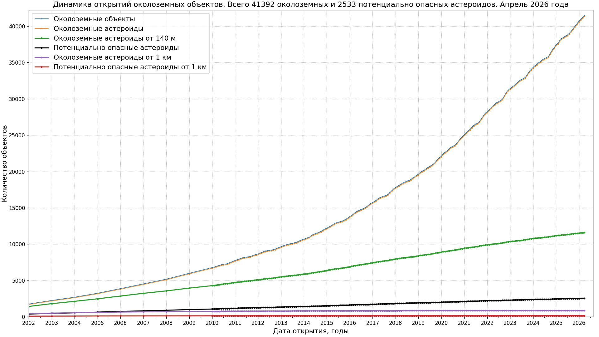
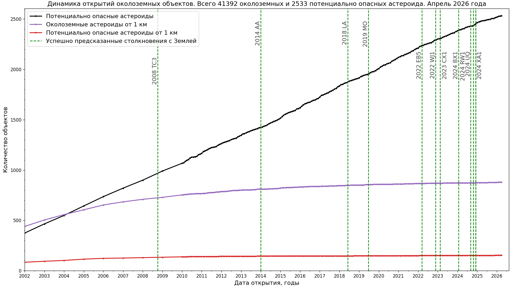
Источник данных: [NASA Center for NEO Studies and IAU Minor Planet Center](https://cneos.jpl.nasa.gov/stats/)
* Распределение тел Солнечной системы по среднему расстоянию до Солнца
")
")
Источник данных: [Центр Малых планет Международного астрономического союза, база данных The MPC Orbit (MPCORB) Database](https://minorplanetcenter.net/iau/MPCORB.html)

Все материалы по работе с данными Солнечной системы:
[иллюстрации](./plots/solarsystem/) и [код](./src/astrodata/solarsystem/)

## Наблюдения сверхновых и других транзиентов

* Динамика открытий сверхновых по годам
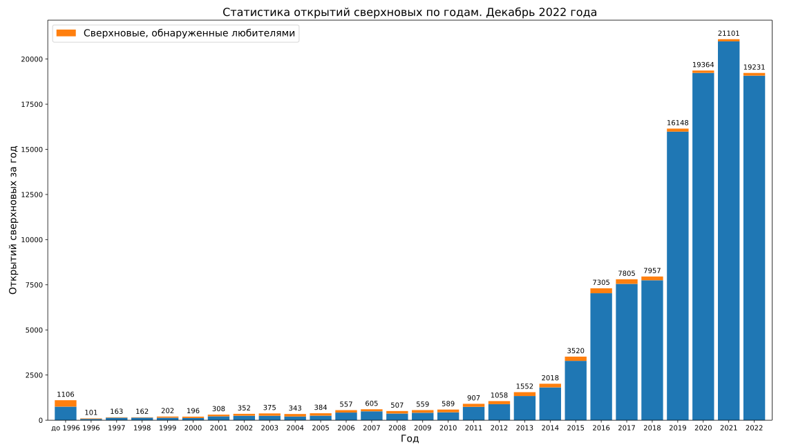
* Совокупное количество открытий сверхновых
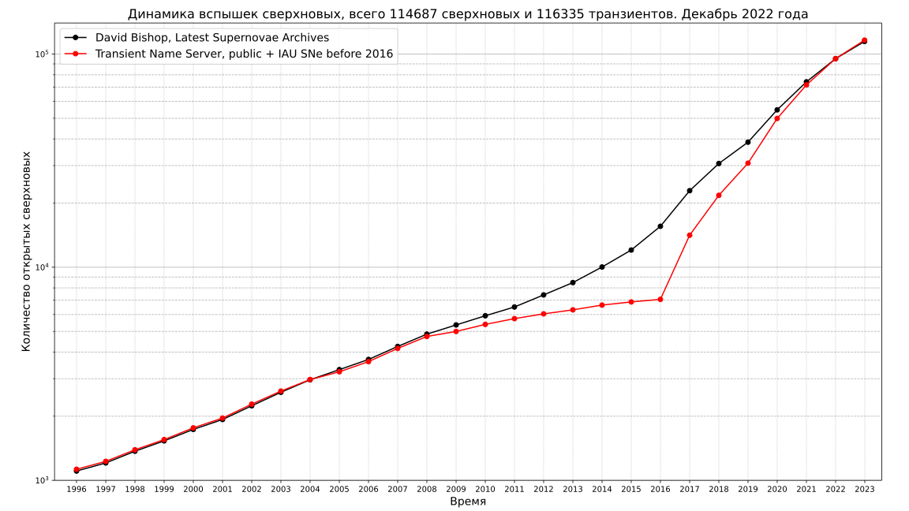
Источник данных: [David Bishop, Latest Supernovae Archives](https://www.rochesterastronomy.org/snimages/archives.html);
[Статистика Transient Name Server](https://www.wis-tns.org/stats-maps).
[Данные в формате JSON](data/stars/sne-stats.json).
[html страница для их отображения с кодом на JavaScript](https://gvard.github.io/stars/snstats/)

* Динамика наблюдения транзиентов по годам, данные Transient Name Server
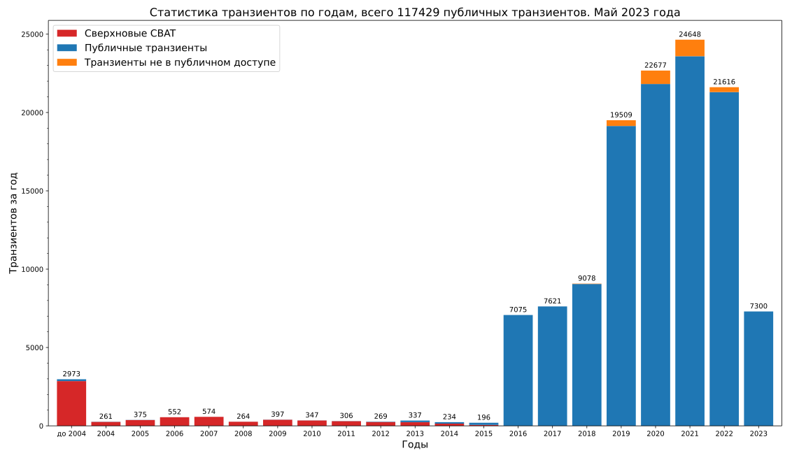
Источник данных: [статистика Transient Name Server](https://www.wis-tns.org/stats-maps)

## Наблюдения гамма-всплесков

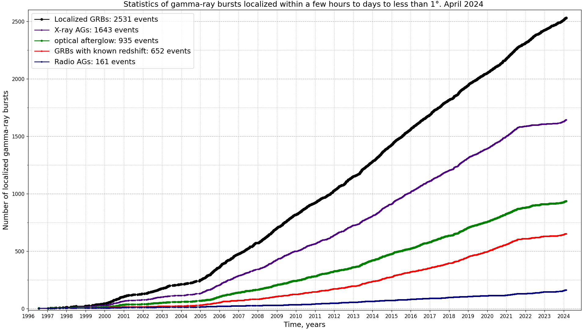
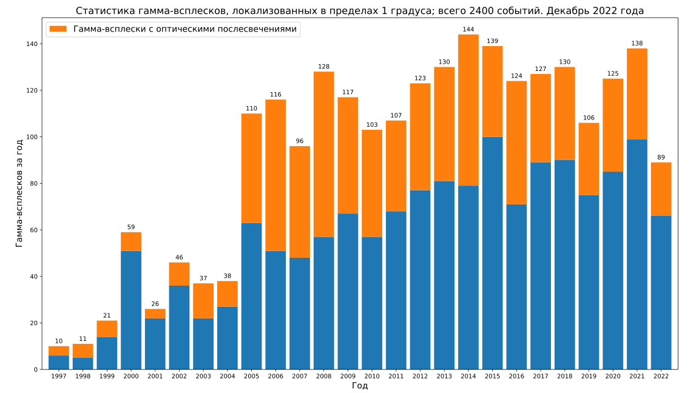
Источник данных: [Jochen Greiner; GRBs localized within a few hours to days to less than 1 degree](https://www.mpe.mpg.de/~jcg/grbgen.html), [данные в формате JSON](data/stars/grbs-localized-stats.json).
[html страница для их отображения с кодом на JavaScript](https://gvard.github.io/grb/stats/)

Все материалы по работе с данными о звездах:
[иллюстрации](./plots/stars/), [код](./src/astrodata/stars/) и [данные](./data/stars/)

## Пилотируемые космические полеты

* Население космоса
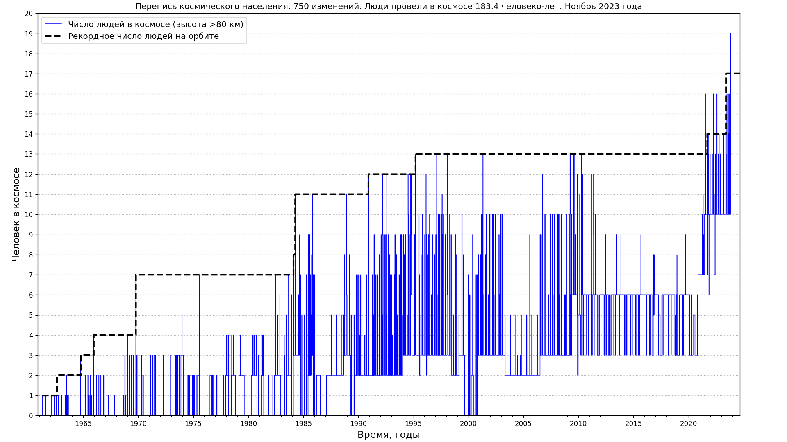
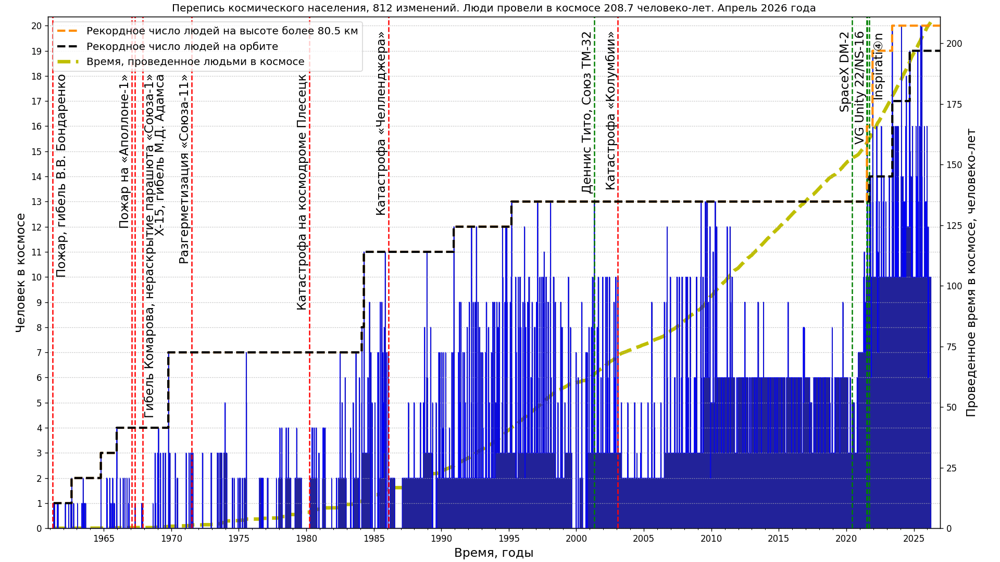
Источник данных: [J. McDowell, planet4589.org](https://planet4589.org/space/astro/web/pop.html)
* Пилотируемые космические миссии, количество космонавтов и посещений космоса
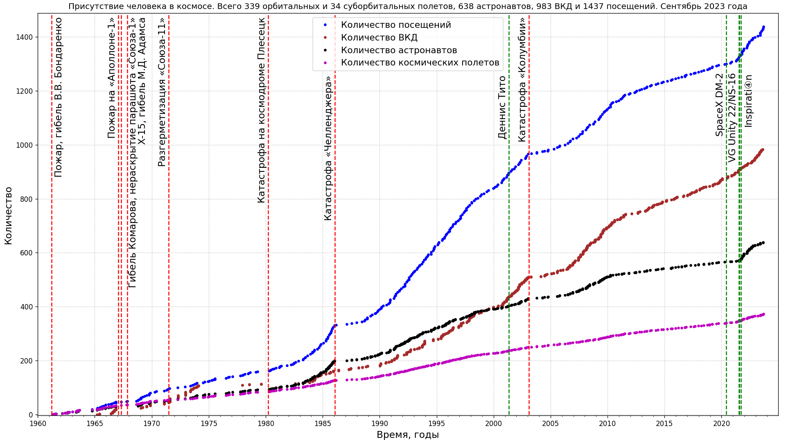
")
Источник данных: [J. McDowell, planet4589.org](https://planet4589.org/space/astro/web/)

Все материалы по работе с данными о пилотируемых космических полетах: [иллюстрации](./plots/manned/) и [код](./src/astrodata/manned/)

## Запуски в космос

* Динамика орбитальных и суборбитальных запусков
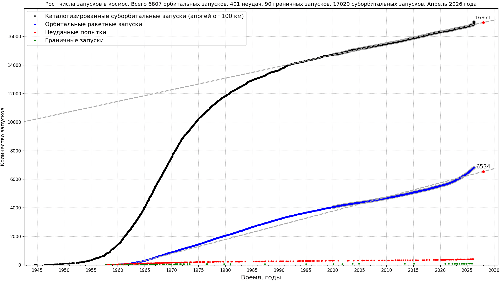  
См. также
[Орбитальные и суборбитальные запуски в космос с апогеем более 80 км с линейной аппроксимацией](./plots/launches/launches-orb-suborb-80km-linfit-ru.png).  
Источник данных: [J. McDowell, planet4589.org](https://planet4589.org/space/gcat/web/launch/)
* Запуски в глубокий космос
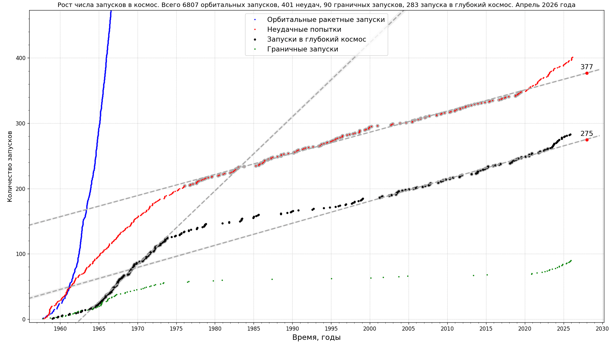
Источник данных: [J. McDowell, planet4589.org, см. event catalogs, deepcat (Deep Space)](https://planet4589.org/space/gcat/web/cat/);
[The Deep Space Catalog: introduction and background, catalog description](https://www.planet4589.org/space/deepcat/).
Код: [скрипт на Python для построения этих графиков](./src/astrodata/launches/plot_launches_orb_suborb_graph.py).

Все материалы по работе с данными о запусках в космос [иллюстрации](./plots/launches/) и [код](./src/astrodata/launches/)

## Применена оптимизация изображений

* [Scour](https://github.com/scour-project/scour)
* [SVG Cleaner](https://github.com/RazrFalcon/svgcleaner)
* [OptiPNG](https://optipng.sourceforge.net/), см. [гайд по оптимизаци PNG](https://optipng.sourceforge.net/pngtech/optipng.html)
* [PNGOut](http://advsys.net/ken/utils.htm)
* [TinyPNG: оптимизация WebP, PNG, JPEG](https://tinypng.com/)
* [Jpegoptim](https://www.kokkonen.net/tjko/projects.html), [для Windows](https://github.com/XhmikosR/jpegoptim-windows)
* [JPEGoptim + OptiPNG + TinyPNG - оптимизация изображений](https://open-networks.ru/d/14-jpegoptim-optipng-tinypng-optimizaciya-izobrazenii)

## Лицензия

[. Свяжитесь со мной для подробностей")](https://creativecommons.org/licenses/by/4.0/)

Свяжитесь со мной для подробностей. Возможно изменение лицензии на более свободную для публикации на веб-ресурсах. Например, в проектах фонда Викимедиа.
