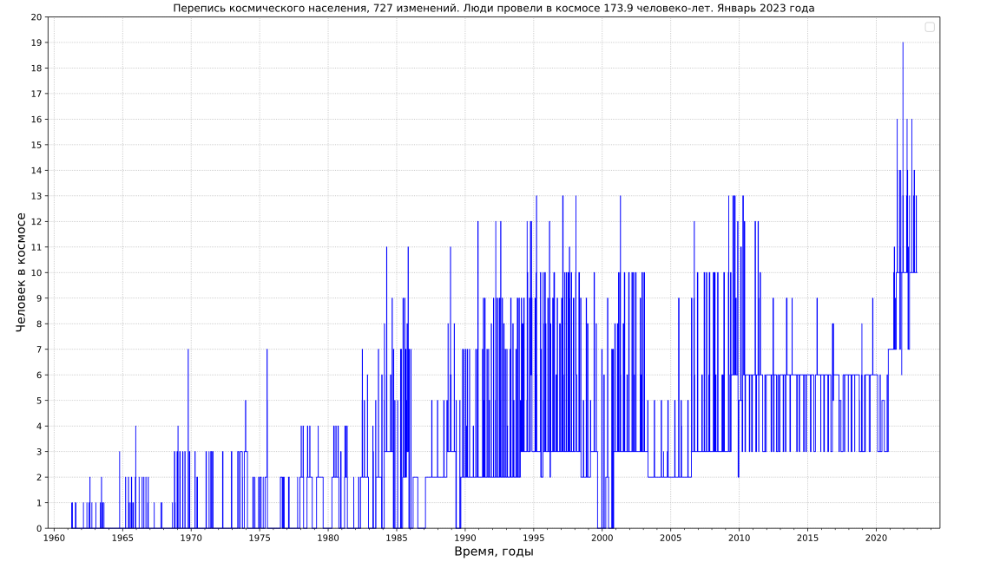

# astrodata
Code for collecting and visualization of astronomical data

All code and description are avaliable at [gvard.github.io](https://gvard.github.io/)

## Manned spaceflights
* Population of space

[Data source: J. McDowell, planet4589.org](https://planet4589.org/space/astro/web/pop.html)

## Image optimization applied
* [Scour](https://github.com/scour-project/scour)
* [SVG Cleaner](https://github.com/RazrFalcon/svgcleaner)