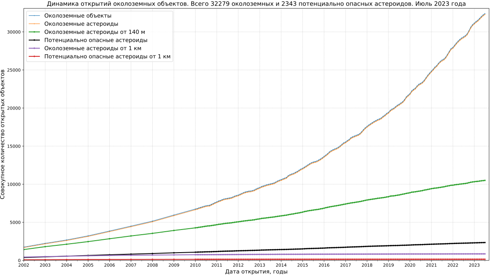
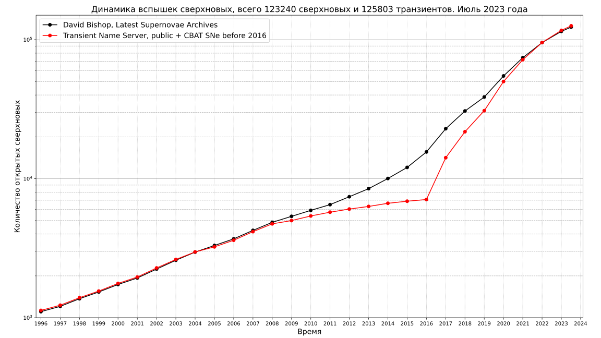
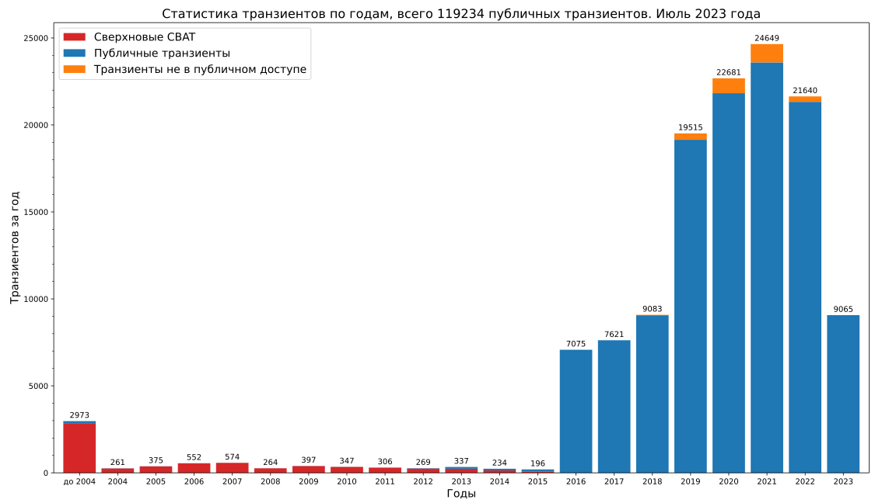
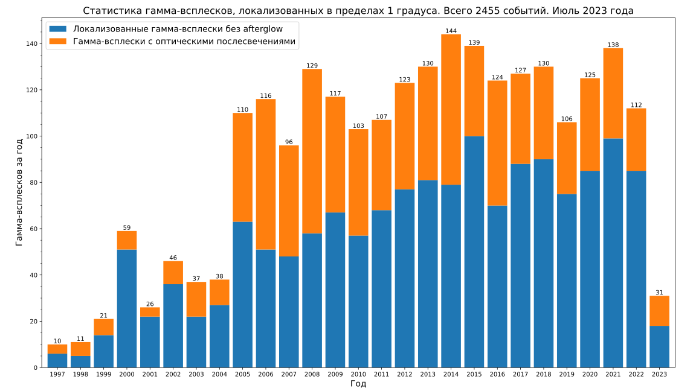
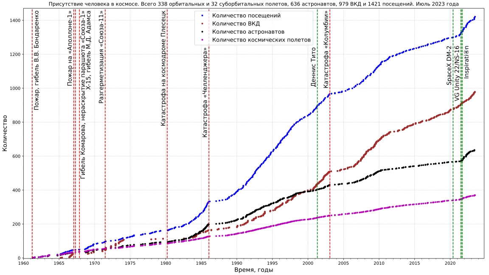
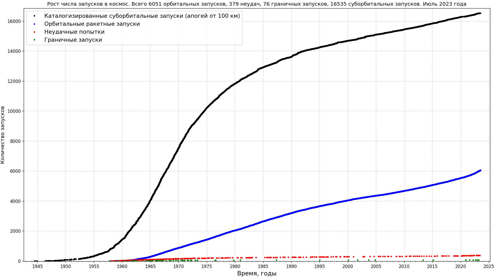

# astrodata
Code for collecting and visualization of astronomical data

All code and description are avaliable at [gvard.github.io](https://gvard.github.io/)

## Solar System objects
* Near-Earth objects and Potentially Hazardous Asteroid statistics

[Data source: NASA Center for NEO Studies and IAU Minor Planet Center](https://cneos.jpl.nasa.gov/stats/)
* Distribution of Solar System bodies by average distance to Sun

[Data source: IAU Minor Planet Center, The MPC Orbit (MPCORB) Database](https://minorplanetcenter.net/iau/MPCORB.html)

## Supernova observations
* History of supernovae observations by year

* Cumulative number of supernovae

[Data source: David Bishop, Latest Supernovae Archives](https://www.rochesterastronomy.org/snimages/archives.html);
[Transient Name Server stats](https://www.wis-tns.org/stats-maps)

* History of transient observations by year from Transient Name Server

[Data source: Transient Name Server stats](https://www.wis-tns.org/stats-maps)

## Gamma-ray bursts observations

[Data source: Jochen Greiner; GRBs localized within a few hours to days to less than 1 degree](https://www.mpe.mpg.de/~jcg/grbgen.html)

## Manned spaceflights
* Population of space

[Data source: J. McDowell, planet4589.org](https://planet4589.org/space/astro/web/pop.html)
* Human Spaceflight Missions, Astronauts, Rides

[Data source: J. McDowell, planet4589.org](https://planet4589.org/space/astro/web/)

## Space launches
* Orbital and suborbital launches counts

[Data source: J. McDowell, planet4589.org](https://planet4589.org/space/gcat/web/launch/)
* Deep Space Launches

[Data source: J. McDowell, planet4589.org](https://planet4589.org/space/gcat/web/cat/)

## Image optimization applied
* [Scour](https://github.com/scour-project/scour)
* [SVG Cleaner](https://github.com/RazrFalcon/svgcleaner)
* [OptiPNG](https://optipng.sourceforge.net/), see [guide to PNG optimization](https://optipng.sourceforge.net/pngtech/optipng.html)
* [PNGOut](http://advsys.net/ken/utils.htm)
* [TinyPNG: WebP, PNG, JPEG optimization](https://tinypng.com/)
* [Jpegoptim](https://www.kokkonen.net/tjko/projects.html), [for Windows](https://github.com/XhmikosR/jpegoptim-windows)
* [JPEGoptim + OptiPNG + TinyPNG - оптимизация изображений](https://open-networks.ru/d/14-jpegoptim-optipng-tinypng-optimizaciya-izobrazenii)
