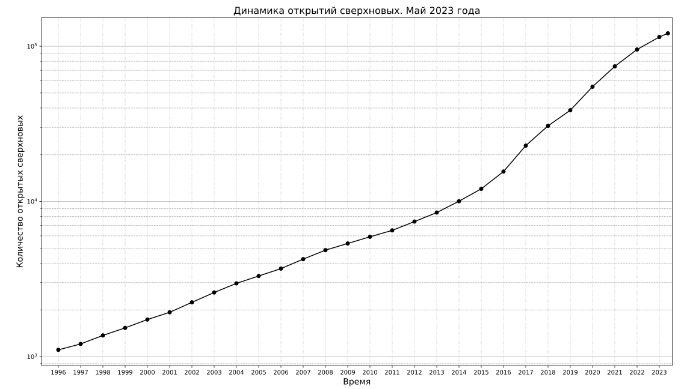

# astrodata
Code for collecting and visualization of astronomical data

All code and description are avaliable at [gvard.github.io](https://gvard.github.io/)

## Supernova observations
* History of supernovae observations by year

* Cumulative number of supernovae

[Data source: David Bishop, Latest Supernovae Archives](https://www.rochesterastronomy.org/snimages/archives.html)

## Manned spaceflights
* Population of space

[Data source: J. McDowell, planet4589.org](https://planet4589.org/space/astro/web/pop.html)
* Human Spaceflight Missions, Astronauts, Rides

[Data source: J. McDowell, planet4589.org](https://planet4589.org/space/astro/web/)

## Space launches
* Orbital and suborbital launches counts

[Data source: J. McDowell, planet4589.org](https://planet4589.org/space/gcat/web/launch/)
* Deep Space Launches

[Data source: J. McDowell, planet4589.org](https://planet4589.org/space/gcat/web/cat/)

## Image optimization applied
* [Scour](https://github.com/scour-project/scour)
* [SVG Cleaner](https://github.com/RazrFalcon/svgcleaner)