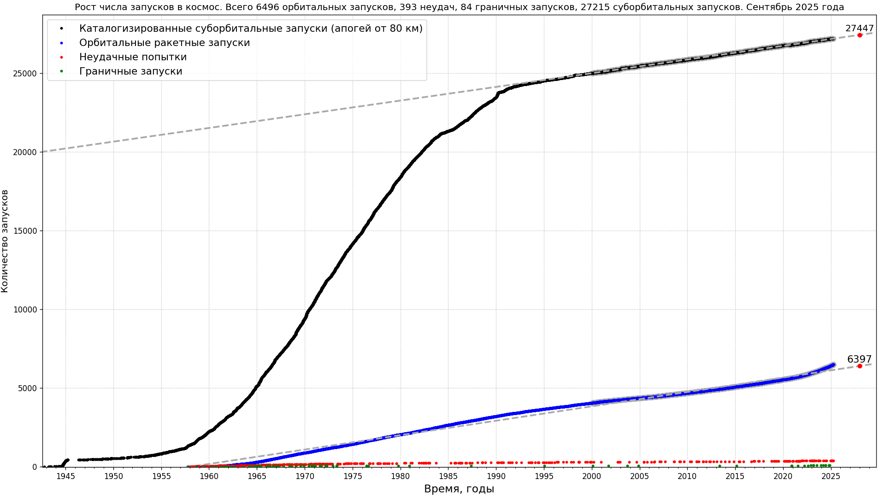
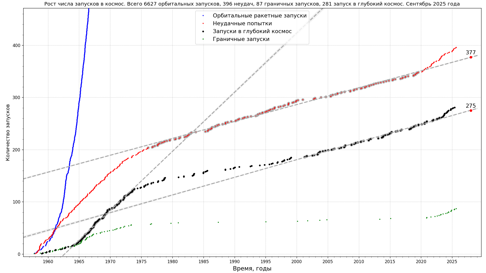

# Space launches

* Рост числа запусков в космос

Данные: [J. McDowell, planet4589.org](https://planet4589.org/space/gcat/web/launch/ldes.html)

* Рост числа запусков в глубокий космос

Данные: [J. McDowell, planet4589.org; see event catalogs, deepcat (Deep Space)](https://planet4589.org/space/gcat/web/cat/);
[The Deep Space Catalog: introduction and Background, catalog description](https://www.planet4589.org/space/deepcat/).
Код: [скрипт на Python для построения этих графиков](../../src/astrodata/launches/plot_launches_orb_suborb_graph.py)

## Применена оптимизация изображений

* [Scour](https://github.com/scour-project/scour)
* [TinyPNG: WebP, PNG, JPEG optimization](https://tinypng.com/)

Код для построения данных изображений [в этом каталоге](../../src/astrodata/launches/)
