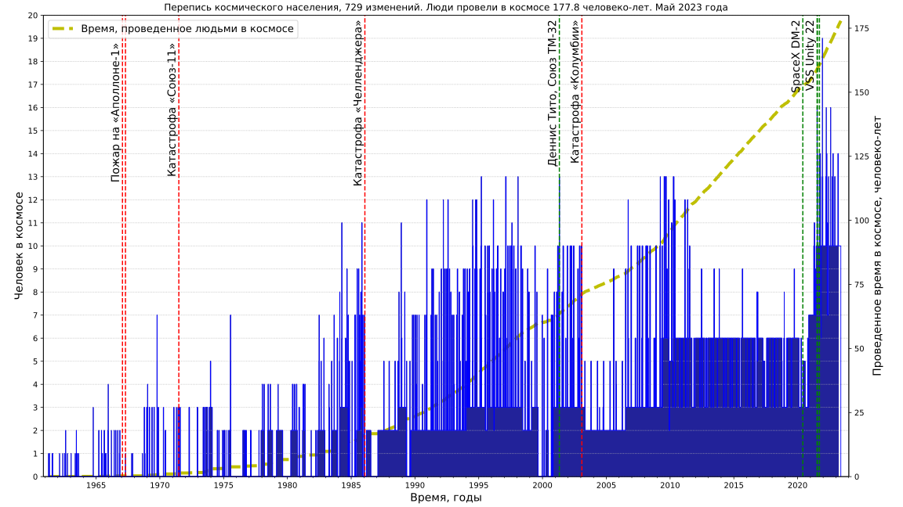

## Manned spaceflights statistics
* Population of space

[Data source: J. McDowell, planet4589.org](https://planet4589.org/space/astro/web/pop.html)
* Human Spaceflight Missions, Astronauts, Rides

[Data source: J. McDowell, planet4589.org](https://planet4589.org/space/astro/web/)
* Extravehicular activity

[Data source: J. McDowell, planet4589.org](https://planet4589.org/space/astro/web/)

## Image optimization applied
* [Scour](https://github.com/scour-project/scour)
* [OptiPNG](https://optipng.sourceforge.net/), see [guide to PNG optimization](https://optipng.sourceforge.net/pngtech/optipng.html)
