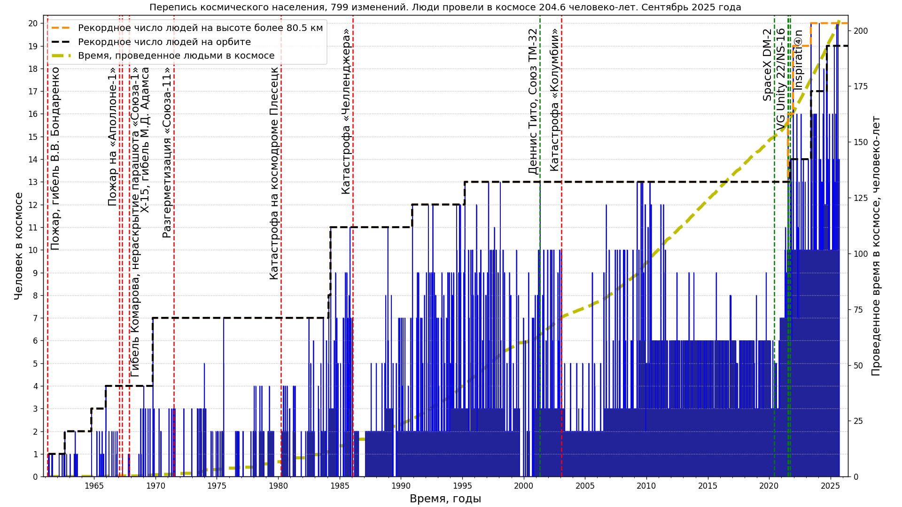

# Manned spaceflights statistics

* Population of space

Data source: [J. McDowell, planet4589.org](https://planet4589.org/space/astro/web/pop.html)
* Human Spaceflight Missions, Astronauts, Rides

Data source: [J. McDowell, planet4589.org](https://planet4589.org/space/astro/web/)
* Extravehicular activity
")
")
")
Data source: [J. McDowell, planet4589.org](https://planet4589.org/space/astro/web/),
[description and definitions](https://planet4589.org/space/astro/web/evas.html).  
Note that EVA (spacewalk) at this data defines as an activity carried out in vacuum conditions
(ambient pressure of less than 50 mbar or 5 kPa) protected at most by a spacesuit.

## Image optimization applied

* [Scour](https://github.com/scour-project/scour)
* [OptiPNG](https://optipng.sourceforge.net/), see [guide to PNG optimization](https://optipng.sourceforge.net/pngtech/optipng.html)

For all manned spaceflights statistics related code see [this directory](../../src/astrodata/manned/)
