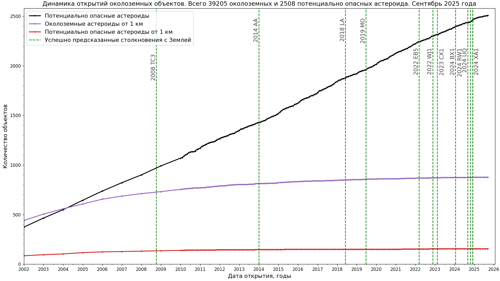

# Статистика объектов Солнечной системы

* Статистика околоземных объектов и потенциально опасных астероидов

Источник данных: [NASA Center for NEO Studies and IAU Minor Planet Center, discovery statistics](https://cneos.jpl.nasa.gov/stats/)  
Код: [python-скрипт для построения графика со статистикой околоземных объектов](../../src/astrodata/solarsystem/plot_neos_population_graph.py)
* Сближения с Землей

Источник данных: [Small-Body DataBase (SBDB) Close-Approach Data API](https://ssd-api.jpl.nasa.gov/doc/cad.html),
[GET-запрос для D < 1.1 LD (lunar distances) после 2020-03-01 до H < 30, отсортированные по абсолютной величине H (mag)](https://ssd-api.jpl.nasa.gov/cad.api?dist-max=1.1LD&date-min=2020-03-01&h-max=30&sort=h).
См. также [list of asteroid close approaches to Earth](https://en.wikipedia.org/wiki/List_of_asteroid_close_approaches_to_Earth)  
Код: [скрипт на python для построения графика сближений астероидов с Землей](../../src/astrodata/solarsystem/plot_close_approaches.py)
* Распределение тел Солнечной системы по среднему расстоянию до Солнца
")
")
Источник данных: [IAU Minor Planet Center, The MPC Orbit (MPCORB) Database](https://minorplanetcenter.net/iau/MPCORB.html),
[Статистика открытий любителей и профессионалов по годам](https://minorplanetcenter.net/iau/special/AmateurDiscoveries.txt)  
Код: [python script for plotting histograms with the distribution of Solar system objects along the semimajor axis](../../src/astrodata/solarsystem/plot_mpcorb_hist.py)
* Распределение крупнейших транснептуновых объектов по абсолютной зв. величине H

См. также [версию только для нумерованных транснептуновых объектов](./tno-a-h-numbered-ru.png).  
Данные: [данные MPC Web Service в формате JSON](../../data/solarsystem/tno-largest.json).
Для получения параметров ненумерованных транснептуновых объектов см. [поиск в базе данных MPC](https://minorplanetcenter.net/db_search)  
Код: см. [MPC Web Service, mpc-fetch.py](https://minorplanetcenter.net/web_service/)
* Распределение малых планет по характеристической скорости орбитального маневра (Δv) и времени перелета
 в диапазоне значений большой полуоси между 0.6 и 2.2 а.е. с отмеченными целями АМС")
  
См. статью [Ultra-low delta-v objects and the human exploration of asteroids (2011)](https://ui.adsabs.harvard.edu/abs/2011P%26SS...59.1408E/abstract).  
Код адаптирован из статьи [A Delta-V map of the known Main Belt Asteroids (2018)](https://ui.adsabs.harvard.edu/abs/2018AcAau.146...73T/abstract),
[pdf](https://planet4589.org/jcm/pubs/sci/papers/2018/Taylor18.pdf), см. файл [Main_Belt_Code_V3.py file from Dataverse](https://dataverse.harvard.edu/dataverse/ElvisMBA),
[Earth-Approaching Asteroids as Targets for Exploration. Shoemaker, E.M. and Helin, E.F., 1978, NASA CP-2053, pp. 245-256 (1978)](https://ntrs.nasa.gov/api/citations/19780021079/downloads/19780021079.pdf)

## Применена оптимизация изображений

* [Scour](https://github.com/scour-project/scour)
* [TinyPNG: WebP, PNG, JPEG optimization](https://tinypng.com/)

Код для работы с данными по Солнечной системе [в этом каталоге](../../src/astrodata/solarsystem/)
