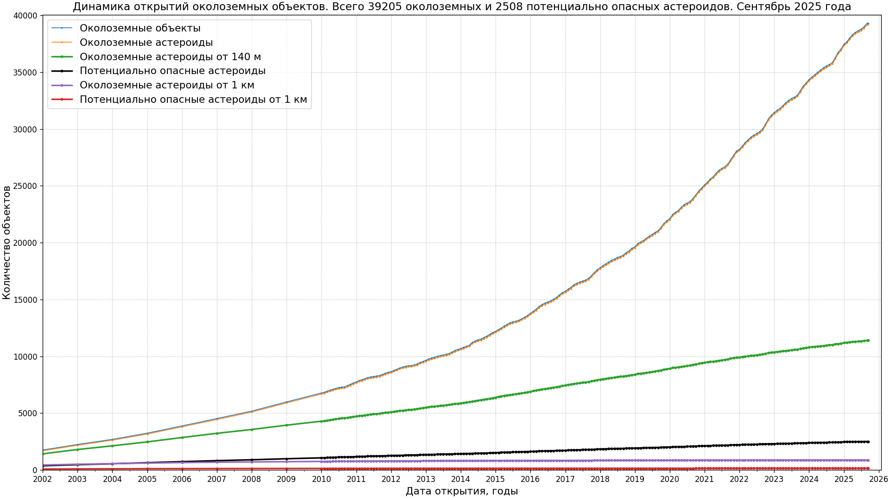

# Статистика объектов Солнечной системы

* Статистика околоземных объектов и потенциально опасных астероидов

Источник данных: [NASA Center for NEO Studies and IAU Minor Planet Center, discovery statistics](https://cneos.jpl.nasa.gov/stats/)
* Распределение тел Солнечной системы по среднему расстоянию до Солнца
")
")
Источник данных: [IAU Minor Planet Center, The MPC Orbit (MPCORB) Database](https://minorplanetcenter.net/iau/MPCORB.html),
[Статистика открытий любителей и профессионалов по годам](https://minorplanetcenter.net/iau/special/AmateurDiscoveries.txt)

## Применена оптимизация изображений

* [Scour](https://github.com/scour-project/scour)
* [TinyPNG: WebP, PNG, JPEG optimization](https://tinypng.com/)

Код для работы с данными по Солнечной системе [в этом каталоге](../../src/astrodata/solarsystem/)
