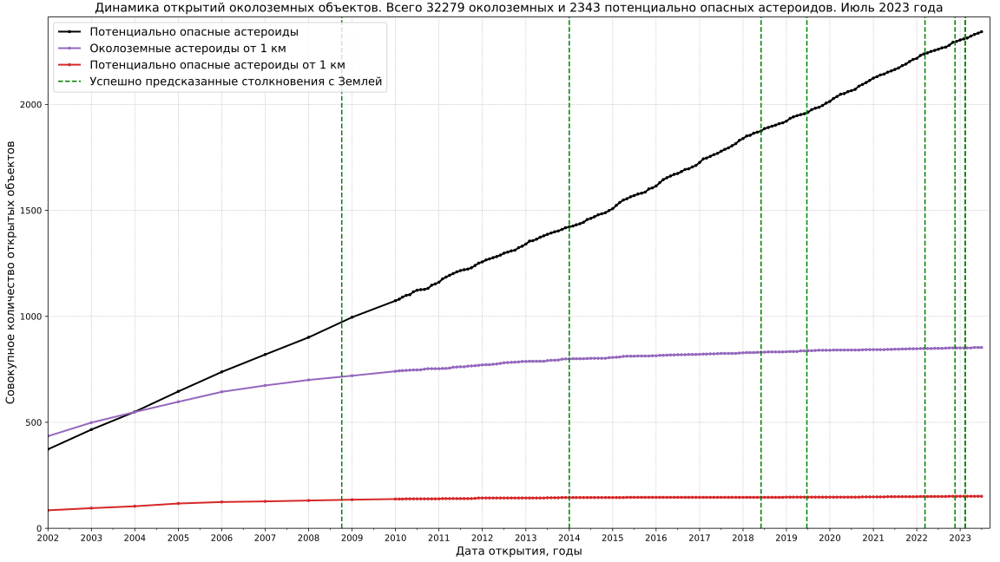

# Solar System objects statistics

* Near-Earth objects and Potentially Hazardous Asteroid statistics

Data source: [NASA Center for NEO Studies and IAU Minor Planet Center, discovery statistics](https://cneos.jpl.nasa.gov/stats/)
* Distribution of Solar System bodies by average distance to Sun
")
")
Data source: [IAU Minor Planet Center, The MPC Orbit (MPCORB) Database](https://minorplanetcenter.net/iau/MPCORB.html),
[break down of amateur discoveries](https://minorplanetcenter.net/iau/special/AmateurDiscoveries.txt)

## Image optimization applied

* [Scour](https://github.com/scour-project/scour)
* [TinyPNG: WebP, PNG, JPEG optimization](https://tinypng.com/)

For all Solar System objects related code see [this directory](../../src/astrodata/solarsystem/)
