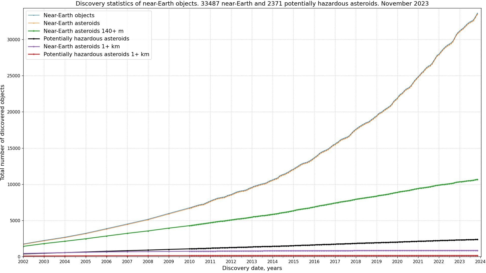
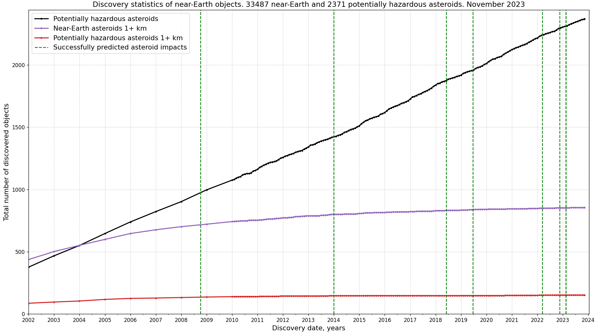
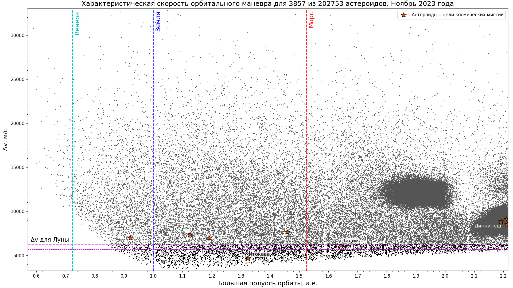

# Solar System objects statistics

* Near-Earth objects and Potentially Hazardous Asteroid statistics

Data source: [NASA Center for NEO Studies and IAU Minor Planet Center, discovery statistics](https://cneos.jpl.nasa.gov/stats/)  
Code: [python script for plotting graph with statistics of near-Earth objects](../../src/astrodata/solarsystem/plot_neos_population_graph.py)
* Close approaches

Data source: [Small-Body DataBase (SBDB) Close-Approach Data API](https://ssd-api.jpl.nasa.gov/doc/cad.html),
[data query for D < 1.1 lunar distances after 2020-03-01 to H < 30 sorted by absolute magnitude H (mag)](https://ssd-api.jpl.nasa.gov/cad.api?dist-max=1.1LD&date-min=2020-03-01&h-max=30&sort=h).
See also [list of asteroid close approaches to Earth](https://en.wikipedia.org/wiki/List_of_asteroid_close_approaches_to_Earth)  
Code: [python script for plotting a chart with close asteroid approaches](../../src/astrodata/solarsystem/plot_close_approaches.py)
* Distribution of Solar System bodies by average distance to Sun
")
")
Data source: [IAU Minor Planet Center, The MPC Orbit (MPCORB) Database](https://minorplanetcenter.net/iau/MPCORB.html),
[break down of amateur discoveries](https://minorplanetcenter.net/iau/special/AmateurDiscoveries.txt)  
Code: [python script for plotting histograms with the distribution of Solar system objects along the semimajor axis](../../src/astrodata/solarsystem/plot_mpcorb_hist.py)
* Distribution of largest trans-Neptunian objects by absolute magnitude H

See [version for only numbered trans-Neptunian objects](./tno-a-h-numbered-ru.png).  
Data: [MPC Web Service output as JSON file](../../data/solarsystem/tno-largest.json).
For parameters of unnumbered trans-Neptunian objects see [MPC Database Search](https://minorplanetcenter.net/db_search)  
Code: see [MPC Web Service, mpc-fetch.py](https://minorplanetcenter.net/web_service/)
* Distribution of minor planets by delta-v and travel time

 time in semimajor axis range between 0.6 and 2.2 with marked spacecraft targets")  
See [Ultra-low delta-v objects and the human exploration of asteroids (2011)](https://ui.adsabs.harvard.edu/abs/2011P%26SS...59.1408E/abstract).  
Code adapted from [A Delta-V map of the known Main Belt Asteroids (2018)](https://ui.adsabs.harvard.edu/abs/2018AcAau.146...73T/abstract),
[pdf](https://planet4589.org/jcm/pubs/sci/papers/2018/Taylor18.pdf), see [Main_Belt_Code_V3.py file from Dataverse](https://dataverse.harvard.edu/dataverse/ElvisMBA),
[Earth-Approaching Asteroids as Targets for Exploration. Shoemaker, E.M. and Helin, E.F., 1978, NASA CP-2053, pp. 245-256 (1978)](https://ntrs.nasa.gov/api/citations/19780021079/downloads/19780021079.pdf)

## Image optimization applied

* [Scour](https://github.com/scour-project/scour)
* [TinyPNG: WebP, PNG, JPEG optimization](https://tinypng.com/)

For all Solar System objects related code see [this directory](../../src/astrodata/solarsystem/)
