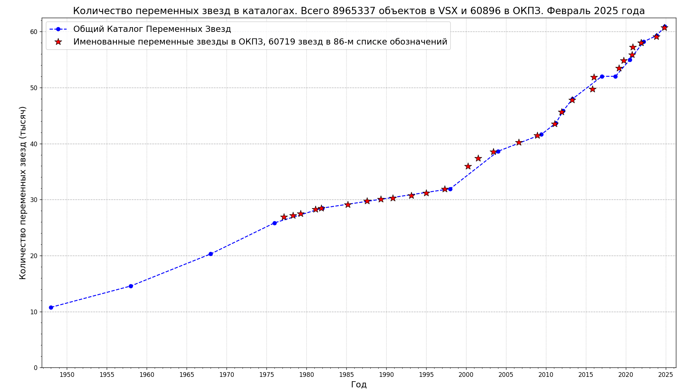
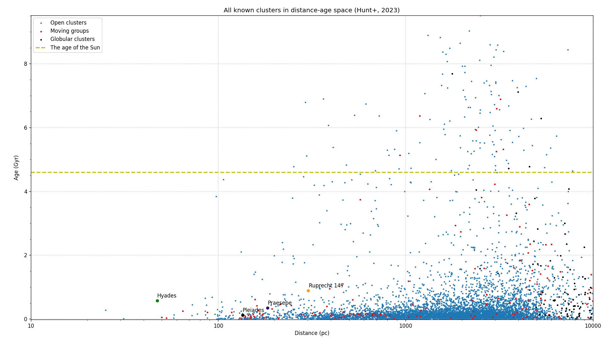
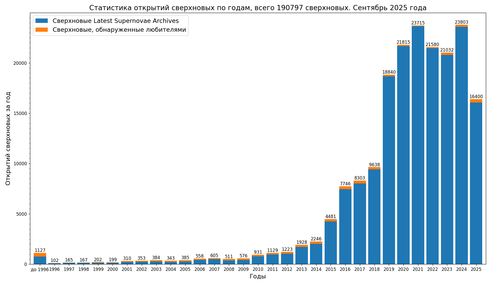
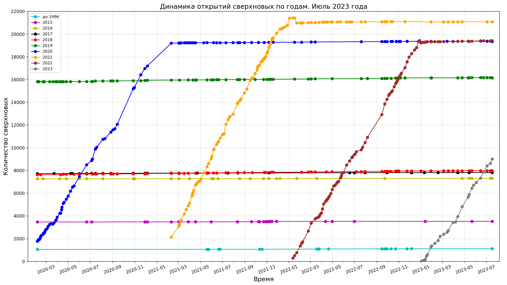
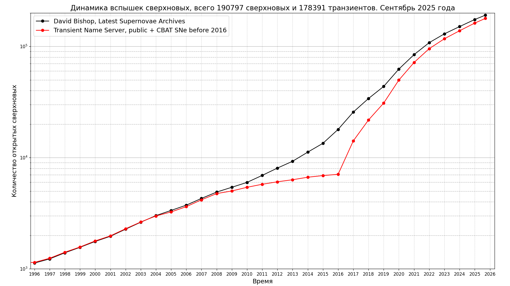
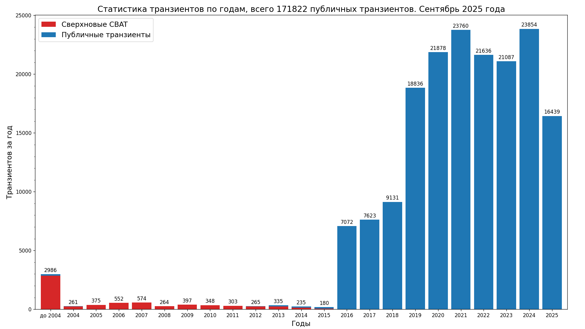
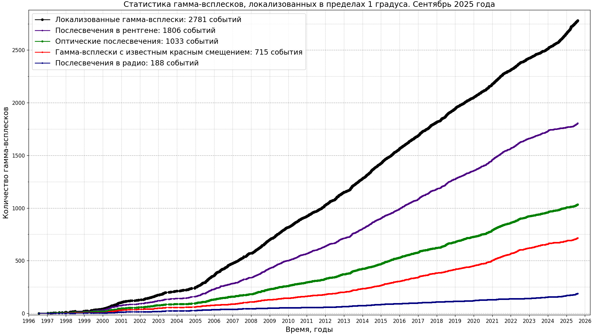
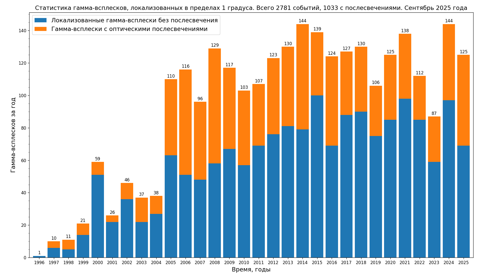

# Звезды

## Переменные звезды

Bar charts with numbers of variable stars types in the General Catalog of Variable Stars (GCVS):

Источник данных: [General Catalog of Variable Stars, latest version](http://www.sai.msu.su/gcvs/gcvs/gcvs5/gcvs5.txt),
Код: [Jupyter Notebook for plotting this chart](../../src/astrodata/stars/plot_gcvs_types_chart_latest.ipynb).

См. также [Numbers of most common variable stars types in the GCVS](./gcvs_types_distribution-combined-sorted.svg);
Источник данных: [General Catalog of Variable Stars (Samus+, 2007-2017), vartype.txt](https://cdsarc.cds.unistra.fr/ftp/B/gcvs/vartype.txt).
Код: [python script with data for plotting this charts](../../src/astrodata/stars/plot_gcvs_types_chart.py)

Источник данных: [The International Variable Star Index (Watson+, 2006-2007)](https://cdsarc.cds.unistra.fr/viz-bin/cat/B/vsx),
Код: [Jupyter Notebook for plotting this chart](../../src/astrodata/stars/plot_vsx_types_chart_latest.ipynb)

Источник данных: [Переменные звезды, открытые учениками ГБПОУ Воробьевы горы](https://caiko.mdp-project.ru/variability/)

Код: [Jupyter Notebook for plotting this charts](../../src/astrodata/stars/plot_variable_stars_types_grouped_chart.ipynb)

, SNe and transients")
Источник данных: [The International Variable Star Index (Watson+, 2006-2007)](https://cdsarc.u-strasbg.fr/ftp/B/vsx/ReadMe).
Код: [python script with data for plotting this charts](../../src/astrodata/stars/plot_variable_stars_counts.py)

## Звездные скопления Млечного пути

. Radius 2s")
См. также [results of cross-matching of clusters members with VSX variables](./vsx_types_distribution-xmatch-hunt2023-2s-combined-sorted-latest.png) and versions with other cross-matching radius.

Источник данных: [Improving the open cluster census. II. An all-sky cluster catalogue with Gaia DR3](https://ui.adsabs.harvard.edu/abs/2023A%26A...673A.114H/abstract),
[VizieR Online Data Catalog. Hunt+, 2023](https://cdsarc.cds.unistra.fr/viz-bin/cat/J/A+A/673/A114).
См. также [Ruprecht 147: The Oldest Nearby Open Cluster as a New Benchmark for Stellar Astrophysics](https://ui.adsabs.harvard.edu/abs/2013AJ....145..134C/abstract).
Код: [python script](../../src/astrodata/stars/plot_clusters_dist_age_distribution.py) and
[Jupyter Notebook](../../src/astrodata/stars/plot_clusters_dist_age_distribution.ipynb) for plotting this chart

## Сверхновые и другие транзиенты

* Динамика открытий сверхновых по годам

Код: [python script with data for plotting this charts](../../src/astrodata/stars/plot_sne_discoveries_numbers.py)
* Совокупное количество открытий сверхновых

* History of transient observations by year from Transient Name Server

Источники данных: [David Bishop, Latest Supernovae Archives](https://www.rochesterastronomy.org/snimages/archives.html),
[Статистика Transient Name Server](https://www.wis-tns.org/stats-maps),
[Central Bureau for Astronomical Telegrams List of SNe](http://www.cbat.eps.harvard.edu/lists/Supernovae.html).
[Данные в формате JSON](../../data/stars/sne-stats.json).
Код: [python script with data for plotting this charts](../../src/astrodata/stars/plot_sne_transients_stats.py).
[html страница для отображения данных с кодом на JavaScript](https://gvard.github.io/stars/snstats/)

## Гамма-всплески

Источник данных: [Jochen Greiner; GRBs localized within a few hours to days to less than 1 degree](https://www.mpe.mpg.de/~jcg/grbgen.html),
[Данные в формате JSON](../../data/stars/grbs-localized-stats.json).  
Код: [python script with data for plotting this charts](../../src/astrodata/stars/plot_localized_grbs_stats.py).  
[html страница для отображения данных с кодом на JavaScript](https://gvard.github.io/grb/stats/)

## Применена оптимизация изображений

* [Scour](https://github.com/scour-project/scour)
* [TinyPNG: оптимизация WebP, PNG, JPEG](https://tinypng.com/)

Код для работы с данными по звездам [в этом каталоге](../../src/astrodata/stars/)
