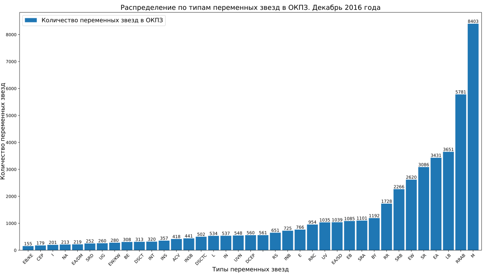
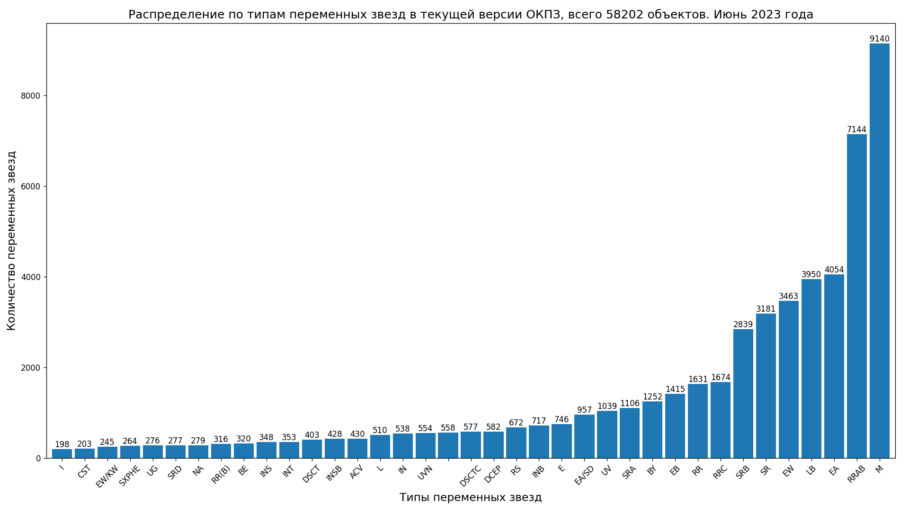
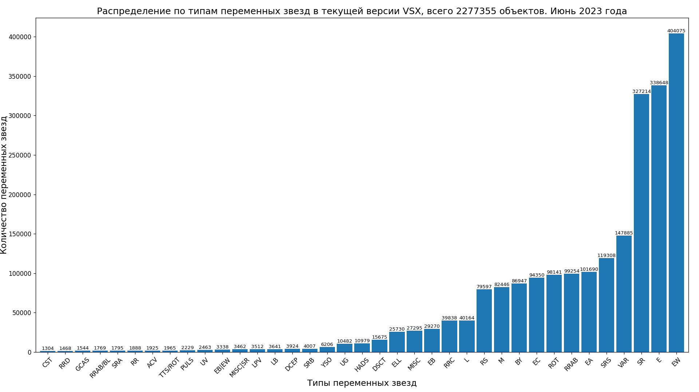
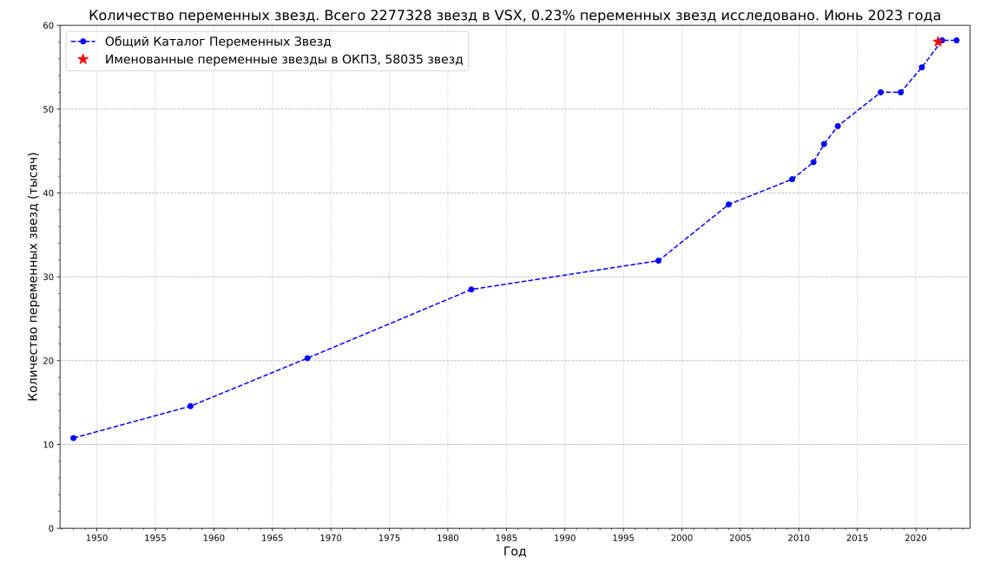
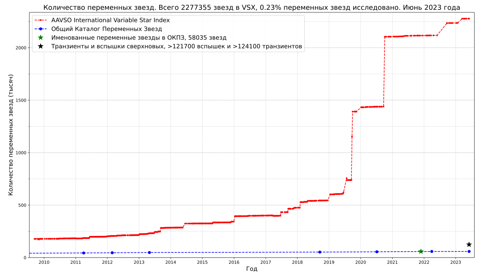

## Variable stars statistics
* Bar charts with numbers of variable stars types in the General Catalog of Variable Stars (GCVS).

[Data source: General Catalog of Variable Stars (Samus+, 2007-2017), vartype.txt](https://cdsarc.cds.unistra.fr/ftp/B/gcvs/vartype.txt)

[Data source: General Catalog of Variable Stars, latest version](http://www.sai.msu.su/gcvs/gcvs/gcvs5/gcvs5.txt)

[Data source: The International Variable Star Index (Watson+, 2006-2007)](https://cdsarc.cds.unistra.fr/viz-bin/cat/B/vsx)

[Data source: The International Variable Star Index (Watson+, 2006-2007)](https://cdsarc.u-strasbg.fr/ftp/B/vsx/ReadMe)

## Supernova observations
* History of supernovae observations by year

* Cumulative number of supernovae

[Data source: David Bishop, Latest Supernovae Archives](https://www.rochesterastronomy.org/snimages/archives.html);
[Transient Name Server stats](https://www.wis-tns.org/stats-maps)

* History of transient observations by year from Transient Name Server

[Data source: Transient Name Server stats](https://www.wis-tns.org/stats-maps)

## Gamma-ray bursts observations

[Data source: Jochen Greiner; GRBs localized within a few hours to days to less than 1 degree](https://www.mpe.mpg.de/~jcg/grbgen.html)