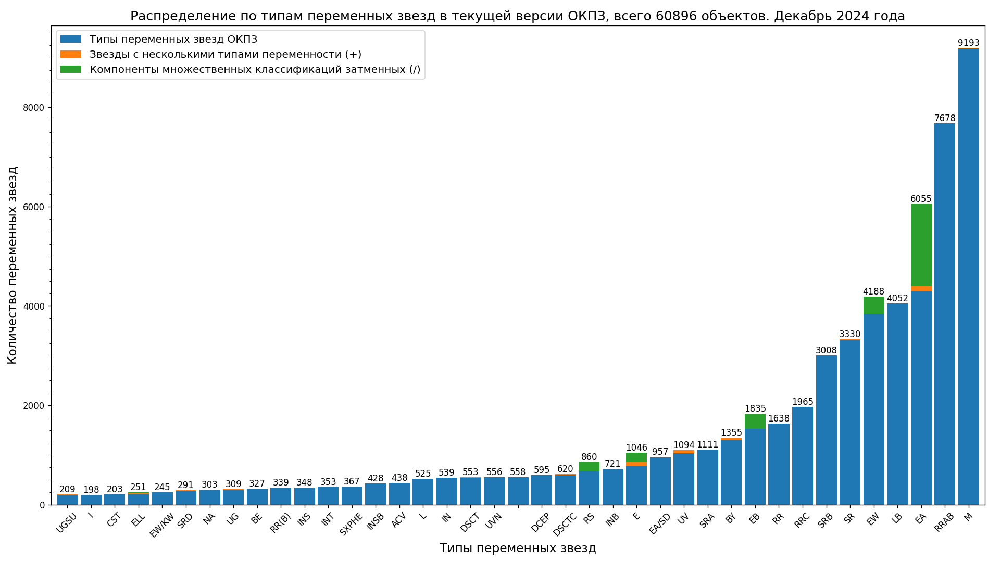
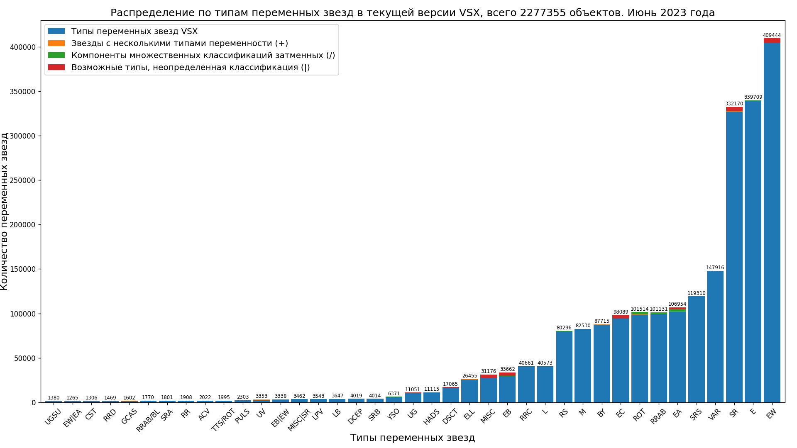
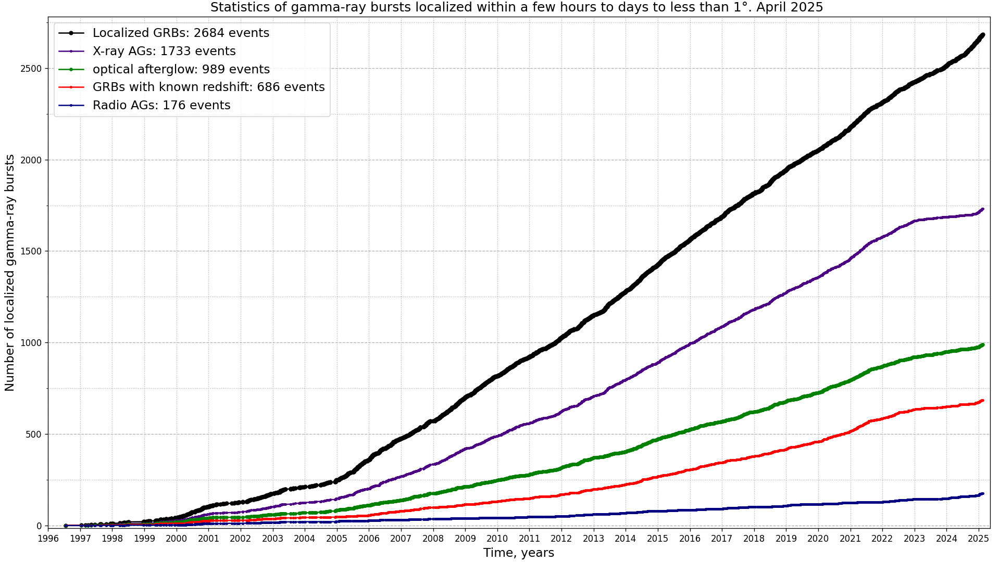

# Stars related plots

## Variable stars statistics

* Bar charts with numbers of variable stars types in the General Catalog of Variable Stars (GCVS).

[Data source: General Catalog of Variable Stars (Samus+, 2007-2017), vartype.txt](https://cdsarc.cds.unistra.fr/ftp/B/gcvs/vartype.txt)
[python script with data for plotting this charts](../../src/astrodata/stars/plot_gcvs_types_chart.py)

[Data source: General Catalog of Variable Stars, latest version](http://www.sai.msu.su/gcvs/gcvs/gcvs5/gcvs5.txt),
[Jupyter Notebook for plotting this chart](../../src/astrodata/stars/plot_gcvs_types_chart_latest.ipynb)

[Data source: The International Variable Star Index (Watson+, 2006-2007)](https://cdsarc.cds.unistra.fr/viz-bin/cat/B/vsx),
[Jupyter Notebook for plotting this chart](../../src/astrodata/stars/plot_vsx_types_chart_latest.ipynb)

[Data source: Переменные звезды, открытые учениками ГБПОУ Воробьевы горы](https://caiko.mdp-project.ru/variability/)

[Jupyter Notebook for plotting this charts](../../src/astrodata/stars/plot_variable_stars_types_grouped_chart.ipynb)

, SNe and transients")
[Data source: The International Variable Star Index (Watson+, 2006-2007)](https://cdsarc.u-strasbg.fr/ftp/B/vsx/ReadMe),
[python script with data for plotting this charts](../../src/astrodata/stars/plot_variable_stars_counts.py)

## Supernova observations

* History of supernovae observations by year

* Cumulative number of supernovae

* History of transient observations by year from Transient Name Server

[Data sources: David Bishop, Latest Supernovae Archives](https://www.rochesterastronomy.org/snimages/archives.html),
[Transient Name Server stats](https://www.wis-tns.org/stats-maps),
[Central Bureau for Astronomical Telegrams List of SNe](http://www.cbat.eps.harvard.edu/lists/Supernovae.html).
[Python script with data for plotting this charts](../../src/astrodata/stars/plot_sne_transients_stats.py)

## Gamma-ray bursts observations

[Data source: Jochen Greiner; GRBs localized within a few hours to days to less than 1 degree](https://www.mpe.mpg.de/~jcg/grbgen.html)
[Python script with data for plotting this charts](../../src/astrodata/stars/plot_localized_grbs_stats.py)

## Image optimization applied

* [Scour](https://github.com/scour-project/scour)
* [TinyPNG: WebP, PNG, JPEG optimization](https://tinypng.com/)

For all stars related code see [this directory](../../src/astrodata/stars/)
