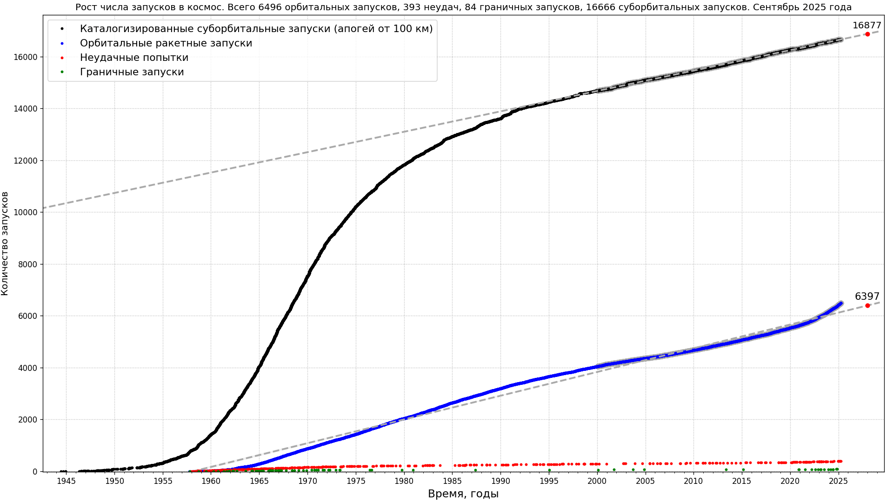

# Запуски в космос

* Рост числа запусков в космос

Data source: [J. McDowell, planet4589.org](https://planet4589.org/space/gcat/web/launch/ldes.html)

* Рост числа запусков в глубокий космос

Data source: [J. McDowell, planet4589.org; см. event catalogs, deepcat (Deep Space)](https://planet4589.org/space/gcat/web/cat/);
[The Deep Space Catalog: introduction and Background, catalog description](https://www.planet4589.org/space/deepcat/).
Код: [скрипт на Python для построения этих графиков](./plot_launches_orb_suborb_graph.py)

## Зависимости

* [Matplotlib](https://matplotlib.org/)
* [Beautiful Soup](https://www.crummy.com/software/BeautifulSoup/bs4/doc/), [на русском языке](https://www.crummy.com/software/BeautifulSoup/bs4/doc.ru/)
* [Scour - an SVG Optimizer / Cleaner](https://github.com/scour-project/scour)

Все иллюстрации по теме запуски в космос - в [этом каталоге](../../../plots/launches/)
