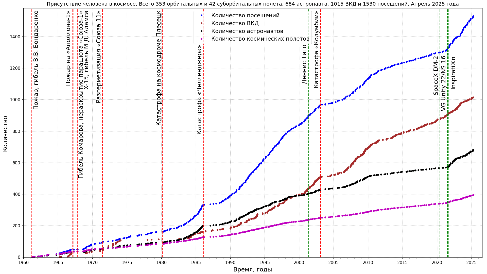

# Статистика пилотируемых космических полетов

* Население космоса

Данные: [J. McDowell, planet4589.org](https://planet4589.org/space/astro/web/pop.html)
* Пилотируемые космические миссии, количество космонавтов и посещений космоса

Данные: [J. McDowell, planet4589.org](https://planet4589.org/space/astro/web/)
* Внекорабельная деятельность (ВКД)
")
")
")
Данные: [J. McDowell, planet4589.org](https://planet4589.org/space/astro/web/),
[описание и определения терминов](https://planet4589.org/space/astro/web/evas.html).  
Обратите внимание: ВКД (выход в открытый космос) в этих данных определяется как деятельность, выполняемая в условиях вакуума (давление окружающей среды менее 50 мбар или 5 кПа), защищенная только скафандром.

## Зависимости

* [Matplotlib](https://matplotlib.org/)
* [Beautiful Soup](https://www.crummy.com/software/BeautifulSoup/bs4/doc/), [на русском языке](https://www.crummy.com/software/BeautifulSoup/bs4/doc.ru/)
* [Scour - an SVG Optimizer / Cleaner](https://github.com/scour-project/scour)

Визуализация данных по пилотируемым полетам [в этом каталоге](../../src/astrodata/manned/)
