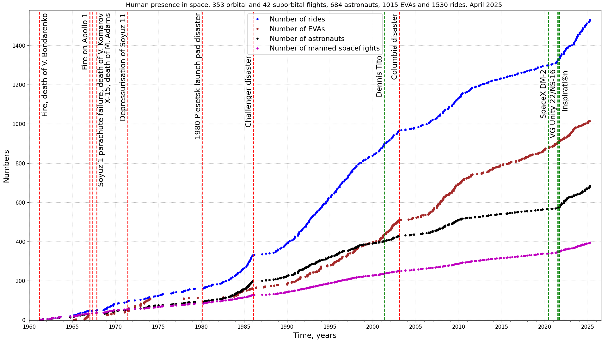

# Manned spaceflights statistics

* Population of space

[Data source: J. McDowell, planet4589.org](https://planet4589.org/space/astro/web/pop.html)
* Human Spaceflight Missions, Astronauts, Rides

[Data source: J. McDowell, planet4589.org](https://planet4589.org/space/astro/web/)
* Extravehicular activity
")
")
")
[Data source: J. McDowell, planet4589.org](https://planet4589.org/space/astro/web/),
[description and definitions](https://planet4589.org/space/astro/web/evas.html).
Note that EVA (spacewalk) at this data defines as an activity carried out in vacuum conditions
(ambient pressure of less than 50 mbar or 5 kPa) protected at most by a spacesuit.

## Dependencies

* [Matplotlib](https://matplotlib.org/)
* [Beautiful Soup](https://www.crummy.com/software/BeautifulSoup/bs4/doc/), [на русском языке](https://www.crummy.com/software/BeautifulSoup/bs4/doc.ru/)
* [Scour - an SVG Optimizer / Cleaner](https://github.com/scour-project/scour)

For all manned spaceflights statistics related images see [this directory](../../../plots/manned/)
