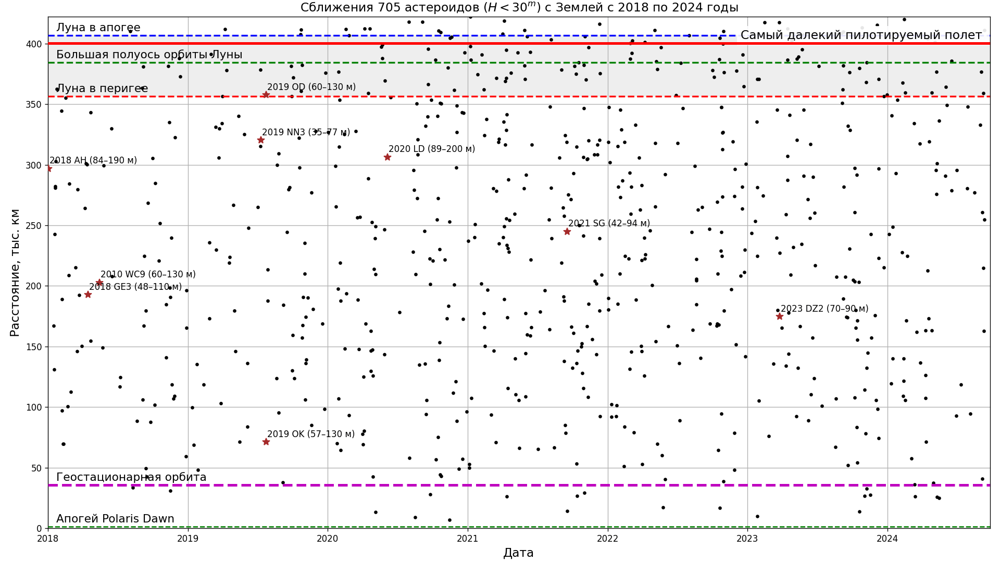

# Solar System objects statistics

* Near-Earth objects and Potentially Hazardous Asteroid statistics

Data source: [NASA Center for NEO Studies and IAU Minor Planet Center, discovery statistics](https://cneos.jpl.nasa.gov/stats/)
* Distribution of Solar System bodies by average distance to Sun
")
")
Data source: [IAU Minor Planet Center, The MPC Orbit (MPCORB) Database](https://minorplanetcenter.net/iau/MPCORB.html),
[break down of amateur discoveries](https://minorplanetcenter.net/iau/special/AmateurDiscoveries.txt)

* Close approaches

Data source: [Small-Body DataBase (SBDB) Close-Approach Data API](https://ssd-api.jpl.nasa.gov/doc/cad.html),
[data query for D < 1.1 lunar distances after 2020-03-01 to H < 30 sorted by absolute magnitude H (mag)](https://ssd-api.jpl.nasa.gov/cad.api?dist-max=1.1LD&date-min=2020-03-01&h-max=30&sort=h).  
Code: [python script for plotting a chart with close asteroid approaches](./plot_close_approaches.py)

## Dependencies

* [Matplotlib](https://matplotlib.org/)
* [Beautiful Soup](https://www.crummy.com/software/BeautifulSoup/bs4/doc/), [on russian](https://www.crummy.com/software/BeautifulSoup/bs4/doc.ru/)
* [Scour - an SVG Optimizer / Cleaner](https://github.com/scour-project/scour)

For all Solar System objects related images see [this directory](../../../plots/solarsystem/)
