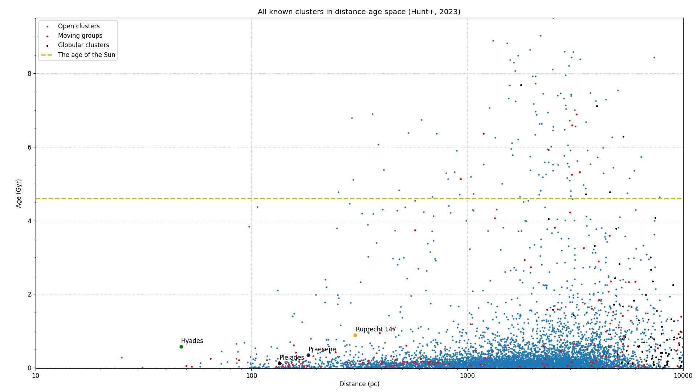
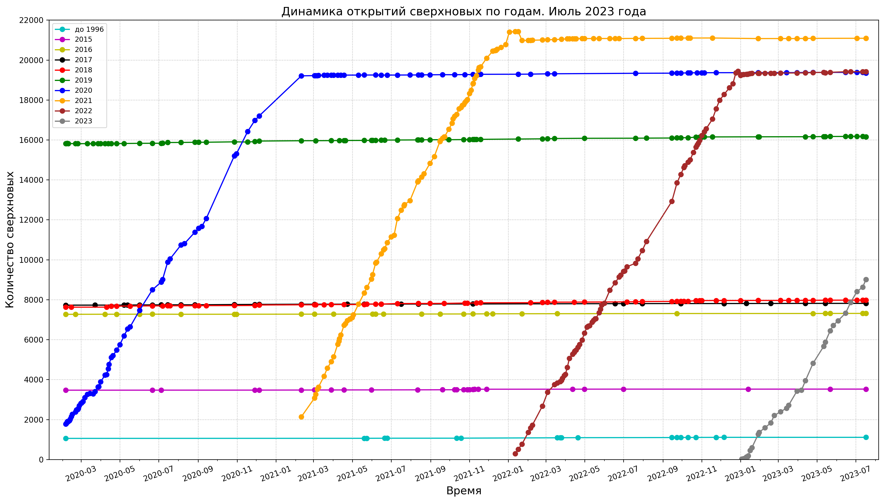

# Stars related code

## Variable stars statistics

Bar charts with numbers of variable stars types in the General Catalog of Variable Stars (GCVS):

Data source: [General Catalog of Variable Stars, latest version](http://www.sai.msu.su/gcvs/gcvs/gcvs5/gcvs5.txt),
Code: [Jupyter Notebook for plotting this chart](./plot_gcvs_types_chart_latest.ipynb)

See also [Numbers of most common variable stars types in the GCVS](../../../plots/stars/gcvs_types_distribution-combined-sorted.svg);
Data source: [General Catalog of Variable Stars (Samus+, 2007-2017), vartype.txt](https://cdsarc.cds.unistra.fr/ftp/B/gcvs/vartype.txt).
Code: [python script with data for plotting this charts](./plot_gcvs_types_chart.py)

Data source: [The International Variable Star Index (Watson+, 2006-2007)](https://cdsarc.cds.unistra.fr/viz-bin/cat/B/vsx),
Code: [Jupyter Notebook for plotting this chart](./plot_vsx_types_chart_latest.ipynb)

Data source: [Переменные звезды, открытые учениками ГБПОУ Воробьевы горы](https://caiko.mdp-project.ru/variability/)

Code: [Jupyter Notebook for plotting this charts](./plot_variable_stars_types_grouped_chart.ipynb)

, SNe and transients")
Data source: [The International Variable Star Index (Watson+, 2006-2007)](https://cdsarc.u-strasbg.fr/ftp/B/vsx/ReadMe).
Code: [python script with data for plotting this charts](./plot_variable_stars_counts.py)

## Milky Way Clusters

. Radius 2s")
See also [results of cross-matching of clusters members with VSX variables](../../../plots/stars/vsx_types_distribution-xmatch-hunt2023-2s-combined-sorted-latest.png) and versions with other cross-matching radius.

Data source: [Improving the open cluster census. II. An all-sky cluster catalogue with Gaia DR3](https://ui.adsabs.harvard.edu/abs/2023A%26A...673A.114H/abstract),
[VizieR Online Data Catalog. Hunt+, 2023](https://cdsarc.cds.unistra.fr/viz-bin/cat/J/A+A/673/A114).
See also [Ruprecht 147: The Oldest Nearby Open Cluster as a New Benchmark for Stellar Astrophysics](https://ui.adsabs.harvard.edu/abs/2013AJ....145..134C/abstract)
Code: [python script](./plot_clusters_dist_age_distribution.py) and
[Jupyter Notebook](./plot_clusters_dist_age_distribution.ipynb) for plotting this chart

## Supernovae and other transients observations

* History of supernovae observations by year

Code: [python script with data for plotting this chart](./plot_sne_discoveries_numbers.py)
* Cumulative number of supernovae

* History of transient observations by year from Transient Name Server

Data sources: [David Bishop, Latest Supernovae Archives](https://www.rochesterastronomy.org/snimages/archives.html),
[Transient Name Server stats](https://www.wis-tns.org/stats-maps),
[Central Bureau for Astronomical Telegrams List of SNe](http://www.cbat.eps.harvard.edu/lists/Supernovae.html).
[Data as JSON](../../../data/stars/sne-stats.json).
Code: [python script with data for plotting this charts](./plot_sne_transients_stats.py).
[Displaying data in html page using JavaScript](https://gvard.github.io/stars/snstats/)

## Gamma-ray bursts observations

Data source: [Jochen Greiner; GRBs localized within a few hours to days to less than 1 degree](https://www.mpe.mpg.de/~jcg/grbgen.html), [data as JSON](../../../data/stars/grbs-localized-stats.json).
Code: [python script with data for plotting this charts](./plot_localized_grbs_stats.py).
[Displaying data in html page using JavaScript](https://gvard.github.io/grb/stats/)

## Dependencies

* [Matplotlib](https://matplotlib.org/)
* [pandas](https://pandas.pydata.org/)
* [Beautiful Soup](https://www.crummy.com/software/BeautifulSoup/bs4/doc/), [на русском языке](https://www.crummy.com/software/BeautifulSoup/bs4/doc.ru/)
* [Scour - an SVG Optimizer / Cleaner](https://github.com/scour-project/scour)

For all stars related images see [this directory](../../../plots/stars/)
